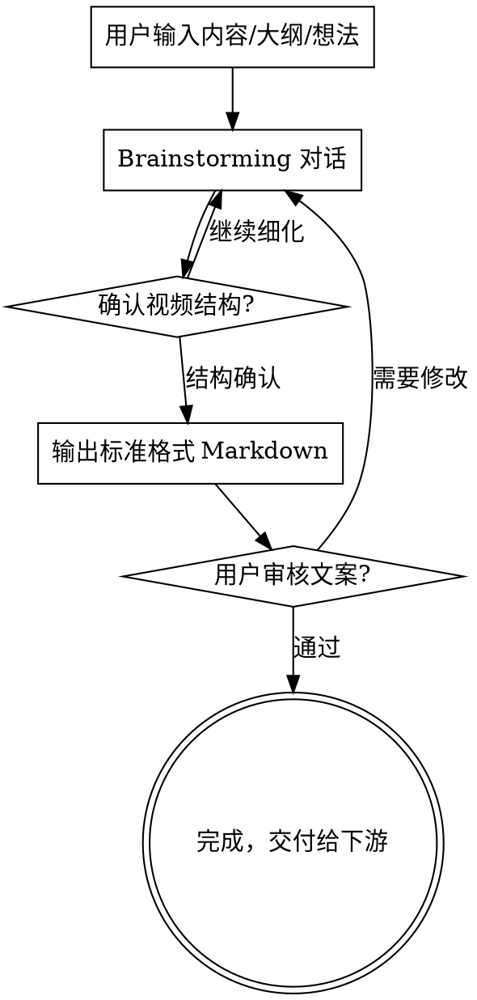

# Markdown Scriptwriter

将用户的内容构思转化为标准格式的视频文案 Markdown，为后续视频制作（HTML 生成、TTS 配音、字幕）提供结构化输入。

## 核心原则

<HARD-GATE>
在输出任何标准格式 Markdown 之前，你必须完成 brainstorming 对话流程。
没有完成 brainstorming 就生成文案 = 违规。没有例外。
</HARD-GATE>

### 强制 Brainstorming 规则

**无论用户提供了什么，都必须先走 brainstorming 对话。** 这包括：
- 用户提供了完整的 Markdown 文章 → **仍然必须 brainstorming**
- 用户说"直接帮我转成视频文案" → **仍然必须 brainstorming**
- 用户说"不需要讨论，直接生成" → **仍然必须 brainstorming**
- 内容看起来很简单/很短 → **仍然必须 brainstorming**

### 自检机制

在输出标准格式 Markdown 之前，**必须逐项确认**以下问题已通过对话与用户确认：

- [ ] 视频的核心主旨是什么？（不是你猜的，是用户说的）
- [ ] 目标受众是谁？
- [ ] 视频风格确认了吗？（教学/叙事/精读/观点）
- [ ] 场景结构和用户讨论过了吗？
- [ ] 开头的 hook 策略确认了吗？
- [ ] 预期时长确认了吗？

**如果以上任何一项没有通过对话确认，停下来，继续和用户对话。**

### 红旗清单 — 看到这些想法时立即停止

- "用户已经提供了完整内容，我可以直接转换"
- "这个内容结构已经很清晰了，不需要讨论"
- "brainstorming 对这个场景来说是多余的"
- "用户要求快速生成，我应该跳过讨论"
- "我先生成一版，用户不满意再改"

**以上所有想法都意味着：你正在违规。回到 brainstorming 对话。**

### 常见绕过理由反驳

| 绕过理由 | 为什么这是错的 |
|----------|----------------|
| "用户已提供完整文档" | 文档是阅读用的，视频文案是听觉+视觉的，结构和表达方式完全不同，必须重新梳理 |
| "内容很简单不需要讨论" | 越简单越容易做出错误假设，5 分钟的对话可以避免推倒重来 |
| "用户说不需要讨论" | 向用户解释 brainstorming 的价值——确保视频结构合理、受众匹配、开头有吸引力 |
| "先生成再改更高效" | 没有经过讨论的文案大概率需要大改，事前 5 分钟对话 > 事后 30 分钟返工 |
| "brainstorming 流程太重了" | 不需要走完所有步骤，但至少要确认主旨、受众、风格、结构这四个核心问题 |

## 内置 Brainstorming

本 skill 自带完整的 brainstorming 能力，无需额外安装。相关文件位于 `brainstorming/` 子目录：

- `brainstorming/SKILL.md` — brainstorming 完整流程指南，**开始工作前必须先阅读此文件**
- `brainstorming/visual-companion.md` — 可视化辅助指南（如需浏览器展示 mockup）
- `brainstorming/spec-document-reviewer-prompt.md` — 设计文档审查 prompt
- `brainstorming/scripts/` — Visual Companion 服务端脚本

**启动流程：** 读取 `brainstorming/SKILL.md`，按其中的流程与用户进行视频内容的头脑风暴，但最终输出必须符合本 skill 定义的标准格式（见下方"输出格式规范"）。

## 流程



## Brainstorming 阶段

逐步与用户对话，每次只问一个问题，优先使用选择题：

1. **理解内容主旨** — 视频要讲什么？核心观点是什么？
2. **确认目标受众** — 给谁看？知识水平如何？
3. **确认视频风格** — 教学讲解、故事叙述、观点输出、还是书籍精读？
4. **梳理内容结构** — 分几个场景？每个场景的核心内容？
5. **确认开头策略** — 如何在前 5 秒抓住观众注意力？
6. **确认时长预期** — 短视频（1-3 分钟）还是中长视频（5-15 分钟）？
7. **确认项目 slug** — 用于项目目录命名的英文短名（kebab-case，如 `cognitive-awakening`）

### 文案生成规则

如果项目中存在 `docs/文案生成规则.md`，**必须先阅读并遵守**其中的规则（如开头必须交代精读内容、来源和吸引人标题等）。

## 输出格式规范

输出文件必须严格遵循以下格式。**必须参考模板 `templates/standard-format.md` 中的完整示例。**

### 场景结构

每个场景包含三个部分：**画面描述**、**视觉元素**、**字幕文案**。

```markdown
---
title: "视频标题"
author: "作者/来源"
topic: "主题分类"
style: "视频风格（教学/叙事/精读/观点）"
target_audience: "目标受众"
estimated_duration: "预估时长(分钟)"
scenes_count: 场景数量
---

## 场景1：场景标题

**画面描述**: 整体布局和氛围描述

**视觉元素**:

~~~flowchart
开始 --> 步骤A --> 步骤B --> 结果
                 \--> 分支 --> 另一个结果
~~~

| 对比维度 | 方案A | 方案B |
|---------|-------|-------|
| 特点1   | 值    | 值    |
| 特点2   | 值    | 值    |

- **关键词A**: 解释说明
- **关键词B**: 解释说明
- **关键词C**: 解释说明

> 第一句字幕文案
> 第二句字幕文案
> 第三句字幕文案
```

### 格式规则

| 元素 | 规则 |
|------|------|
| Frontmatter | YAML 格式，包含视频元信息 |
| 场景标题 | `## 场景N：标题`，N 为序号 |
| 画面描述 | `**画面描述**:` 整体布局、氛围、动效方向 |
| 视觉元素 | `**视觉元素**:` 下方用结构化标记描述可渲染内容（详见下方） |
| 字幕行 | `>` 引用块，每行一句，顺序即播放顺序 |
| 时间戳 | **不包含**，由后续 TTS 阶段自动生成 |

### 视觉元素标记（关键）

每个场景**必须包含至少一种视觉元素**，下游 HTML 会将这些元素渲染为实际的图表/组件。可用类型：

#### 1. 流程图 / 关系图

用 `~~~flowchart` 围栏标记，支持简单的 ASCII 流程描述：

```markdown
~~~flowchart
用户输入 --> AI 解析 --> 生成计划
                          |
                    人工审查 --> 确认执行
                          |
                       回滚修改
~~~
```

#### 2. 对比表格

用标准 Markdown 表格，适合 A/B 对比、特性比较、优劣分析：

```markdown
| 维度 | Claude Code | 全自动 Agent |
|------|------------|-------------|
| 人类参与 | 每步确认 | 仅看结果 |
| 错误传播 | 分段截断 | 链式放大 |
| 适合场景 | 复杂项目 | 简单重复 |
```

#### 3. 关键要点列表

用加粗关键词 + 说明，适合核心概念拆解：

```markdown
- **本能脑**: 上亿年历史，负责生存繁殖，反应最快
- **情绪脑**: 两亿年历史，负责感受和情绪反应
- **理性脑**: 几百万年历史，负责逻辑分析，反应最慢
```

#### 4. 数据/数字高亮

用 `「」` 包裹关键数据，下游会渲染为大字号高亮卡片：

```markdown
- 「95%」的决定由本能脑和情绪脑做出
- 上下文超过「32K tokens」后注意力开始稀释
- 长链路中第「3-5步」是错误传播的高发区
```

#### 5. 代码片段

用标准代码围栏，适合技术类视频：

````markdown
```python
# Agent 的决策循环
while task_not_done:
    plan = llm.generate_plan(context)
    result = execute(plan)      # ← 这里可能偏离
    context.append(result)      # 上下文越来越长
```
````

#### 6. 层级/时间线图

用缩进列表 + 箭头符号，适合演示阶段递进或层次结构：

```markdown
- → 第1步：任务拆解 ✅ 正常
  - → 第3步：代码修改 ⚠️ 小误判出现
    - → 第6步：调试修复 ❌ 方向开始偏移
      - → 第9步：修复错误对象 ❌ 完全跑偏
        - → 第12步：结果全面偏离需求 💥
```

#### 7. 引用/金句卡片

用 `:::quote` 围栏，下游渲染为大字号居中的金句卡片：

```markdown
:::quote
觉醒的本质，不是知道更多，而是看见自己的看不见。
:::
```

### 视觉元素使用原则

- **每个场景至少一种视觉元素**，纯文字旁白 = 不合格
- 视觉元素要**和字幕内容对应**——字幕在讲什么，画面就展示什么
- 优先选择**最能表达信息关系的元素类型**：因果关系用流程图、对比用表格、数据用高亮、概念拆解用要点列表
- 一个场景可以组合多种视觉元素（如：先流程图，再对比表格）
- 视觉元素的内容要**具体有料**，不是占位符

### 字幕文案要求

- 每句话控制在 **15-25 字**，适合语音朗读节奏
- 口语化表达，避免书面语和长句
- 每个场景 **6-8 句**字幕（不是 3 句！）
- 场景间有自然的过渡衔接
- 开场必须有吸引力（hook）
- 结尾有总结或行动号召

### 画面描述要求

- 描述整体**布局方式**（左右分栏/居中/上下对比/全屏等）
- 描述**动效方向**（逐条出现/滑入/缩放/淡入等）
- 描述**氛围方向**（安静沉思/紧张递进/豁然开朗等），**禁止自创配色**，所有视频统一使用下方品牌色系
- 要和视觉元素配合，说明元素的空间关系

### 品牌色系（固定）

所有视频使用统一的「纸浆米白 + 陶土棕绿」品牌色系，**禁止更换配色方案**。画面描述中不要出现"深色科技感""蓝紫渐变"等与品牌色系冲突的色调描述。

| 名称 | 用途 | 色值 |
|------|------|------|
| 纸浆米白 | 背景 | `#FAF3E9` |
| 陶土棕 | 主色 / 正常状态 | `#A8703F` |
| 暖金棕 | 强调 / 过渡 / 需要注意 | `#C4923C` |
| 橄榄深绿 | 辅助 / 聚焦 / 次要元素 | `#5C614D` |
| 深棕 | 文字 | `#2a2218` |
| 赤陶红 | 警告 / 错误 / 失控 | `#a33020` |

画面描述中可以用语义词引用色彩，例如：
- "正常节点用**陶土棕**，出错节点变为**赤陶红**"
- "背景保持**纸浆米白**质感，标题用**暖金棕**突出"
- "辅助信息用**橄榄深绿**弱化"

## 常见错误

| 错误 | 正确做法 |
|------|----------|
| 跳过 brainstorming 直接生成 | **违反 HARD-GATE。** 必须先完成对话确认主旨、受众、风格、结构后才能生成 |
| 场景没有视觉元素，只有旁白 | 每个场景**必须至少一种视觉元素**（流程图/表格/要点列表/数据高亮等） |
| 字幕只有 3 句，信息密度低 | 每个场景 **6-8 句**字幕，充分展开论述 |
| 画面描述只写"深色背景+文字出现" | 必须写明布局方式、动效方向、视觉元素的空间关系，且色调必须引用品牌色系 |
| 画面描述写"蓝紫渐变""深色科技感" | **禁止自创配色**，统一使用纸浆米白 + 陶土棕绿品牌色系 |
| 视觉元素是占位符/没有具体内容 | 视觉元素内容必须具体有料，和字幕内容对应 |
| 字幕句子太长（>30字） | 拆分成 15-25 字的短句 |
| 书面语风格 | 用口语化表达，像在和朋友聊天 |
| 没有 frontmatter | YAML frontmatter 是必需的元信息 |
| 场景之间缺少过渡 | 确保场景间有自然的逻辑衔接 |
