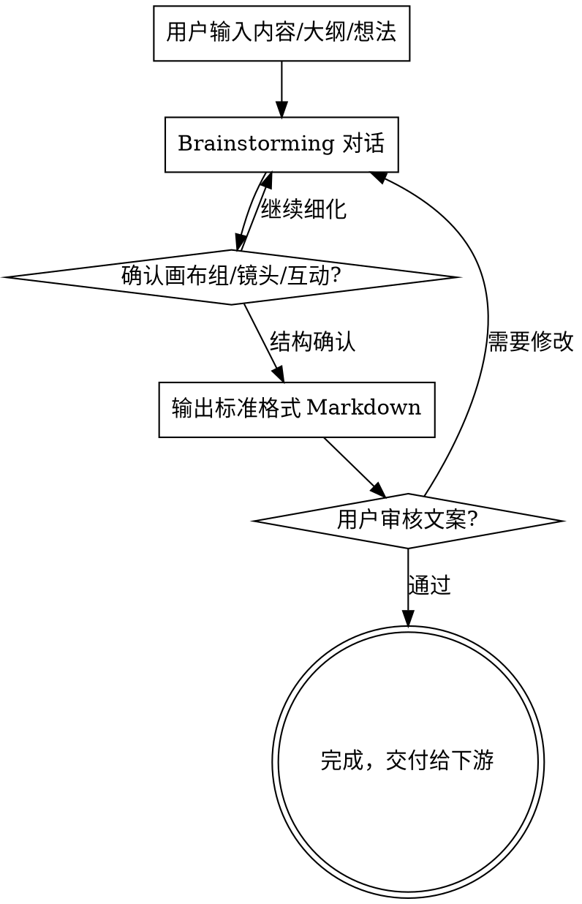

# Markdown Scriptwriter

将用户的内容构思转化为标准格式的视频文案 Markdown，为后续视频制作（HTML 生成、TTS 配音、字幕）提供结构化输入。

## 核心架构：镜头蒙太奇模型

> 我们的最小画面单位是**镜头**（Shot），而非"场景"。每个镜头对应一句话术（5-40字），时长 1-10 秒，天然与 TTS 一一对齐。

| 概念 | 定义 |
|------|------|
| **镜头（Shot）** | 最小调度单位。一镜一句，5-40 字话术，1-10 秒时长 |
| **画布组（Canvas Group）** | 逻辑分组单位。3-8 个镜头共享画布，对应一个完整概念段落 |
| **镜头关系** | `切换`（全新画面）或 `延续`（画布保留，增量变化） |
| **互动镜头** | 特殊镜头，用于观众互动引导（关注/弹幕/点赞） |

## 核心原则

<HARD-GATE>
在输出任何标准格式 Markdown 之前，你必须完成 brainstorming 对话流程。
没有完成 brainstorming 就生成文案 = 违规。没有例外。
</HARD-GATE>

### 强制 Brainstorming 规则

**无论用户提供了什么，都必须先走 brainstorming 对话。** 这包括：
- 用户提供了完整的 Markdown 文章 → **仍然必须 brainstorming**
- 用户说"直接帮我转成视频文案" → **仍然必须 brainstorming**
- 用户说"不需要讨论，直接生成" → **仍然必须 brainstorming**
- 内容看起来很简单/很短 → **仍然必须 brainstorming**

### 自检机制

在输出标准格式 Markdown 之前，**必须逐项确认**以下问题已通过对话与用户确认：

- [ ] 视频的核心主旨是什么？（不是你猜的，是用户说的）
- [ ] 目标受众是谁？
- [ ] 视频风格确认了吗？（教学/叙事/精读/观点）
- [ ] 画布组划分确认了吗？（几个大段落？每段核心概念？）
- [ ] 开头的 hook 策略确认了吗？
- [ ] 预期时长确认了吗？
- [ ] 互动节点位置确认了吗？（哪些地方放互动？）
- [ ] 整体镜头节奏预期确认了吗？（信息密度偏高还是偏低？）

**如果以上任何一项没有通过对话确认，停下来，继续和用户对话。**

### 红旗清单 — 看到这些想法时立即停止

- "用户已经提供了完整内容，我可以直接转换"
- "这个内容结构已经很清晰了，不需要讨论"
- "brainstorming 对这个场景来说是多余的"
- "用户要求快速生成，我应该跳过讨论"
- "我先生成一版，用户不满意再改"

**以上所有想法都意味着：你正在违规。回到 brainstorming 对话。**

### 常见绕过理由反驳

| 绕过理由 | 为什么这是错的 |
|----------|----------------|
| "用户已提供完整文档" | 文档是阅读用的，视频文案是听觉+视觉的，结构和表达方式完全不同，必须重新梳理 |
| "内容很简单不需要讨论" | 越简单越容易做出错误假设，5 分钟的对话可以避免推倒重来 |
| "用户说不需要讨论" | 向用户解释 brainstorming 的价值——确保视频结构合理、受众匹配、开头有吸引力 |
| "先生成再改更高效" | 没有经过讨论的文案大概率需要大改，事前 5 分钟对话 > 事后 30 分钟返工 |
| "brainstorming 流程太重了" | 不需要走完所有步骤，但至少要确认主旨、受众、风格、画布组划分这四个核心问题 |

## 内置 Brainstorming

本 skill 自带完整的 brainstorming 能力，无需额外安装。相关文件位于 `brainstorming/` 子目录：

- `brainstorming/SKILL.md` — brainstorming 完整流程指南，**开始工作前必须先阅读此文件**
- `brainstorming/visual-companion.md` — 可视化辅助指南（如需浏览器展示 mockup）
- `brainstorming/spec-document-reviewer-prompt.md` — 设计文档审查 prompt
- `brainstorming/scripts/` — Visual Companion 服务端脚本

**启动流程：** 读取 `brainstorming/SKILL.md`，按其中的流程与用户进行视频内容的头脑风暴，但最终输出必须符合本 skill 定义的标准格式（见下方"输出格式规范"）。

## 流程



## Brainstorming 阶段

逐步与用户对话，每次只问一个问题，优先使用选择题：

1. **理解内容主旨** — 视频要讲什么？核心观点是什么？
2. **确认目标受众** — 给谁看？知识水平如何？
3. **确认视频风格** — 教学讲解、故事叙述、观点输出、还是书籍精读？
4. **梳理画布组划分** — 分几个大段落？每段核心概念是什么？
5. **确认镜头节奏** — 信息密度偏高还是偏低？平均每镜头多少字？
6. **确认开头策略** — 如何在前 5 秒抓住观众注意力？
7. **确认互动节点** — 在哪些位置放置互动引导？（建议每 60-90 秒一个）
8. **确认时长预期** — 短视频（1-3 分钟）还是中长视频（5-15 分钟）？
9. **确认项目 slug** — 用于项目目录命名的英文短名（kebab-case，如 `cognitive-awakening`）

### 文案生成规则

如果项目中存在 `docs/文案生成规则.md`，**必须先阅读并遵守**其中的规则（如开头必须交代精读内容、来源和吸引人标题等）。

## 输出格式规范

输出文件必须严格遵循以下格式。**必须参考模板 `templates/standard-format.md` 中的完整示例。**

### 文件结构

```markdown
---
title: "视频标题"
author: "作者/来源"
topic: "主题分类"
style: "视频风格（教学/叙事/精读/观点）"
target_audience: "目标受众"
estimated_duration: "预估时长(分钟)"
total_shots: 镜头总数
canvas_groups: 画布组数
---

## 画布组 1：组标题

### 镜头 1（切换）
**话术**: "口播内容"
**画面类型**: 类型ID
**元素**: 视觉元素描述
**动效**: 动画效果描述

### 镜头 2（延续）
**话术**: "口播内容"
**画面类型**: 类型ID
**元素**: 增量变化描述
**动效**: 增量动画描述

## 画布组 2：组标题

### 镜头 3（切换）
...

### [互动] 镜头 N
**话术**: "互动引导语"
**画面类型**: interaction
**元素**: 互动视觉元素
**动效**: 互动动画描述
```

### 格式规则

| 元素 | 规则 |
|------|------|
| Frontmatter | YAML 格式，包含视频元信息 + 镜头/画布组计数 |
| 画布组标题 | `## 画布组 N：标题`，N 为序号 |
| 镜头标题 | `### 镜头 N（关系）`，关系为 `切换` 或 `延续` |
| 互动镜头 | `### [互动] 镜头 N`，特殊标记 |
| 话术 | `**话术**:` 一句口播，5-40 字 |
| 画面类型 | `**画面类型**:` 类型 ID（见画面类型系统） |
| 元素 | `**元素**:` 具体视觉元素描述，含位置和内容 |
| 动效 | `**动效**:` 元素入场/变化/退出方式 |

### 画面类型系统

每个镜头声明一种主画面类型，决定视觉渲染策略：

| 类型 ID | 名称 | 描述 | 渲染方式 |
|---------|------|------|----------|
| `character` | 角色/IP | 卡通人物、形象 | SVG 简笔角色 + CSS 动画 |
| `screenshot` | 截图引用 | 产品界面、博客文章、代码截图 | SVG 模拟的界面框架 + 占位内容 |
| `icon-combo` | 图标组合 | 多个图标 + 文字标注 + 连线 | SVG 图标阵列 + CSS 动画入场 |
| `concept-map` | 概念图/流程图 | 节点、连线、关系 | SVG 节点图 + drawPath 动画 |
| `code-demo` | 代码演示 | 代码片段、终端输入输出 | 深色终端模拟 + 逐行打字效果 |
| `text-effect` | 文字排版特效 | 大字标题、关键词强调、文字动画 | CSS 文字动画（scale/fade/逐字出现） |
| `comparison` | 对比展示 | 并列对比、A/B 展示 | SVG 分区布局 + 并排条形/色块 |
| `interaction` | 互动引导 | 点赞、关注、弹幕提示 | 图标动画 + CTA 文字 |

**类型组合**：一个镜头可以有一个主类型 + 辅助元素。例如：
- `character + text-effect`（角色旁边出现文字标题）
- `concept-map + icon-combo`（流程图节点用图标表示）

### 镜头关系规则

| 关系 | 含义 | 使用场景 |
|------|------|----------|
| `切换` | 全新画面构图 | 画布组的第一个镜头**必须**是切换；概念完全转换时使用 |
| `延续` | 画布保留，增量变化 | 同一概念的展开、补充、深入 |

**画布组的第一个镜头必须是 `切换`**，后续镜头通常为 `延续`。

### 话术要求

- 每镜头一句话，**5-40 字**
- 口语化表达，像在和朋友聊天
- 一镜一个信息点，不堆砌
- 画布组内话术有连贯逻辑
- 画布组间有自然过渡
- 开场必须有吸引力（hook）
- 结尾有总结或行动号召

### 元素描述要求

- **具体有料**：不是"出现一些图标"，而是"左侧出现 ChatGPT 图标(蓝绿色圆形)，右侧出现 Claude 图标(橙色圆形)"
- **标注位置**：使用"左上/右下/居中/左侧/右侧"等方位词
- **延续镜头只写增量**：不重复前一镜头已有的元素，只描述新增/变化/退出的部分
- **和话术对应**：话术在讲什么，画面就展示什么

### 动效描述要求

- 描述元素如何出现（淡入/缩放/滑入/逐字出现/绘制路径）
- 描述元素如何变化（高亮/变色/移动/缩放）
- 描述元素如何消失（淡出/缩小/滑出）
- 不写 CSS 实现细节，只写视觉效果

### 互动镜头要求

- 建议每 60-90 秒放置一个互动镜头
- 互动类型：关注引导、弹幕互动（"弹幕扣个 0"）、点赞提示
- 话术简短直接（10-20 字）
- 有专门的视觉样式（图标动画 + 文字提示）

### 品牌色系（固定）

所有视频使用统一的「纸浆米白 + 陶土棕绿」品牌色系，**禁止更换配色方案**。元素描述中不要出现"深色科技感""蓝紫渐变"等与品牌色系冲突的色调描述。

| 名称 | 用途 | 色值 |
|------|------|------|
| 纸浆米白 | 背景 | `#FAF3E9` |
| 陶土棕 | 主色 / 正常状态 | `#7A4F2A` |
| 暖金棕 | 强调 / 过渡 | `#B8802E` |
| 橄榄深绿 | 辅助 / 次要 | `#4A6741` |
| 深棕 | 文字 | `#1a1408` |
| 赤陶红 | 警告 / 错误 | `#8B2515` |

元素描述中可以用语义词引用色彩，例如：
- "正常节点用**陶土棕**，出错节点变为**赤陶红**"
- "背景保持**纸浆米白**质感，标题用**暖金棕**突出"
- "辅助信息用**橄榄深绿**弱化"

## 节奏与密度指南

| 视频类型 | 镜头平均时长 | 每分钟镜头数 | 画布组大小 |
|---------|------------|------------|-----------|
| 高密度科普 | 2-3 秒 | 20-30 个 | 3-5 个镜头/组 |
| 中等节奏讲解 | 3-5 秒 | 12-20 个 | 4-6 个镜头/组 |
| 慢节奏叙事 | 5-8 秒 | 8-12 个 | 5-8 个镜头/组 |

**前 30 秒黄金法则**：前 30 秒内必须有 6+ 个画面变化（镜头切换），快速建立节奏感。

## 常见错误

| 错误 | 正确做法 |
|------|----------|
| 跳过 brainstorming 直接生成 | **违反 HARD-GATE。** 必须先完成对话确认主旨、受众、风格、画布组划分后才能生成 |
| 话术超过 40 字 | 拆分为多个镜头，一镜一个信息点 |
| 话术不足 5 字 | 合并到相邻镜头，或扩展信息量 |
| 画布组第一个镜头不是"切换" | 画布组首镜头必须是"切换"，建立全新画面 |
| 延续镜头重复描述已有元素 | 延续镜头只写增量——新增/变化/退出的部分 |
| 元素描述模糊（"出现一些图标"） | 必须具体：什么图标、什么位置、什么颜色/大小 |
| 没有互动镜头 | 每 60-90 秒至少一个互动节点 |
| 画面类型缺失 | 每个镜头必须声明画面类型 |
| 前 30 秒画面变化不足 | 前 30 秒必须 6+ 个镜头切换 |
| 书面语风格 | 用口语化表达，像在和朋友聊天 |
| 没有 frontmatter | YAML frontmatter 是必需的元信息，含 total_shots 和 canvas_groups |
| 画布组之间缺少过渡 | 确保画布组间有自然的逻辑衔接 |
| 动效描述写 CSS/SVG 实现细节 | 只写"视觉效果"，不写技术实现 |
| 使用与品牌色系冲突的色调 | **禁止自创配色**，统一使用纸浆米白 + 陶土棕绿品牌色系 |
| 所有镜头都是同一个画面类型 | 混合使用多种画面类型，保持视觉丰富度 |
